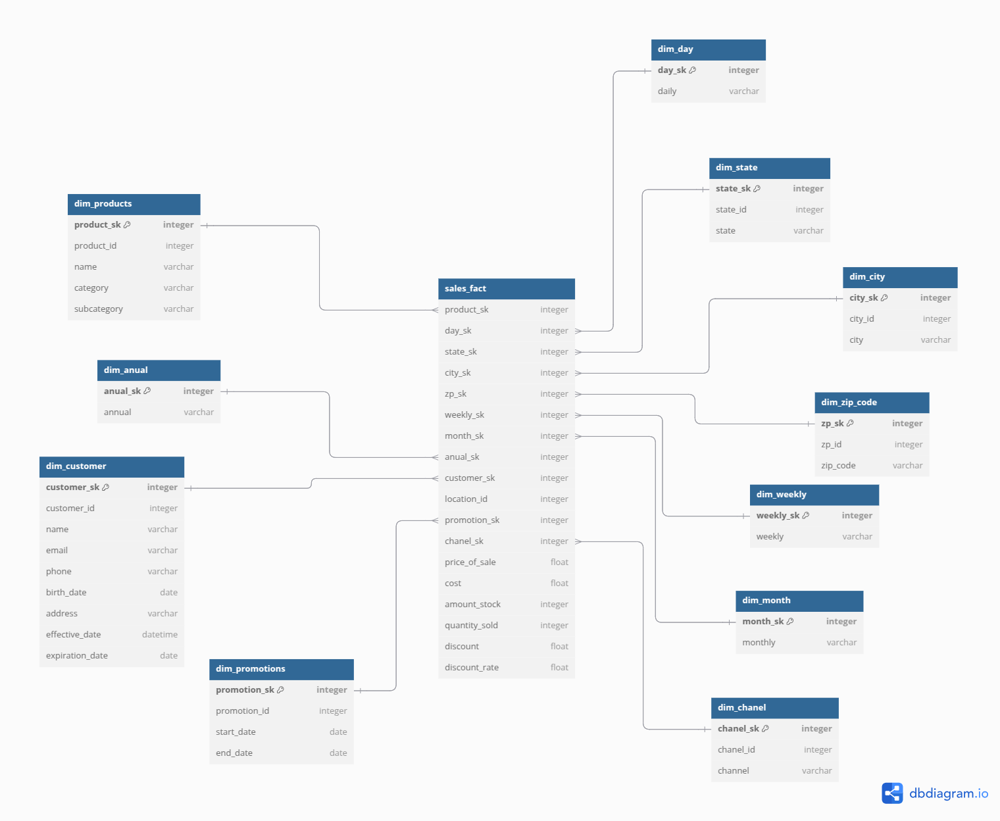

### **Scenario: Online Sales System**

## **Business Context**

An e-commerce company wants to improve the analysis of its sales data in order to optimize marketing strategies, predict trends and identify the most profitable products. Currently, the data is stored in transactional systems, making complex queries and historical analysis difficult.

---

### **Business Needs:**

1. **Sales analysis by period:** The company wants to understand daily, weekly, monthly and annual sales to identify seasonality.
2. **Performance by product:** To identify which products are performing best in terms of quantity sold and revenue generated.
3. **Analysis by region:** Observe sales trends by state, city and zip code.
4. **Customer behavior:** Analyze which customers are the most recurrent, their average ticket and frequency of purchase.
5. **Sales channel:** Evaluate the performance of the channels (website, mobile app and marketplace).
6. **Promotions:** Understand the impact of promotions on increasing sales and net profit.
7. **Inventory control:** Integrate sales and inventory data to predict replenishment needs.

--

### **Raw Bases (Data Sources):**

1. **Sales (`sales`)**
    - `sale_id` (unique ID of the sale)
    - `product_id` (ID of the product sold)
    - `customer_id` (Customer ID)
    - `sale_date` (Date of sale)
    - `sale_time` (Time of sale)
    - `quantity` (Quantity sold)
    - `price` (Unit price)
    - `discount` (Discount applied)
    - `channel` (Sales channel: website, app, marketplace)
2. **Customers (`customers`)**
    - `customer_id` (Unique customer ID)
    - `name` (Customer's name)
    - `email` (customer's e-mail address)
    - `phone` (Customer's phone number)
    - `birth_date` (Date of birth)
    - `address` (Full address)
    - `city` (City)
    - `state` (State)
    - `zip_code` (ZIP code)
3. **Products (`products`)**
    - `product_id` (Unique product ID)
    - `name` (Product name)
    - `category` (Product category)
    - `subcategory` (Product subcategory)
    - `price` (Unit price)
    - `cost` (Product cost)
    - `stock` (Quantity in stock)
4. **Promotions (`promotions`)**
    - `promotion_id` (Unique promotion ID)
    - `product_id` (Product associated with the promotion)
    - `discount_rate` (Discount percentage)
    - `start_date` (Start date)
    - `end_date` (End date)
5. **Stock (`inventory`)**
    - `product_id` (Product ID)
    - `warehouse_id` (Warehouse ID)
    - `current_stock` (Current quantity in stock)
    - `last_updated` (Last stock update)

## Necessary developments

 - Data modeling (Dimensional)
 - ETL
 - insolate project (Doker)
 - Up workflow tools
 - Data visualization

 ## Data model

***Link***: https://dbdiagram.io/d/dm_sales-67928e9c37f5d6cbebbad2db

